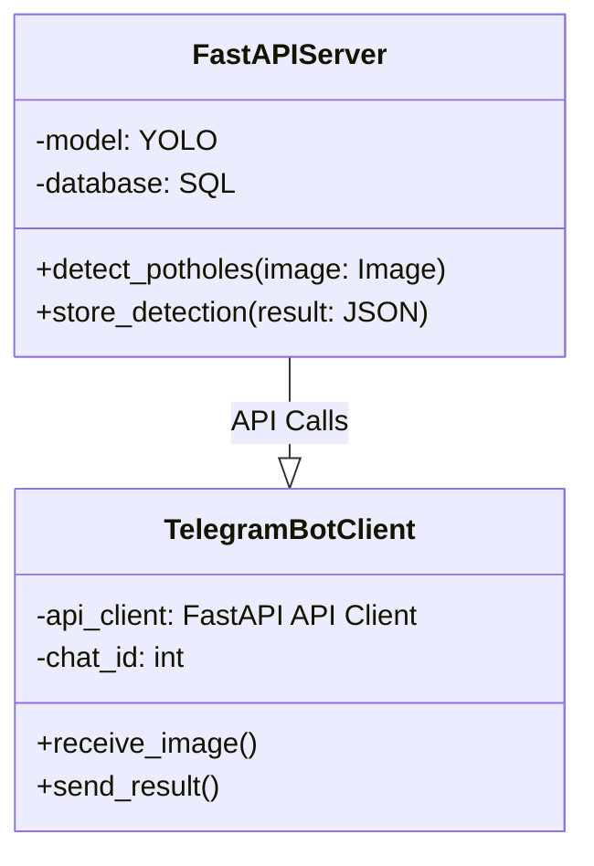
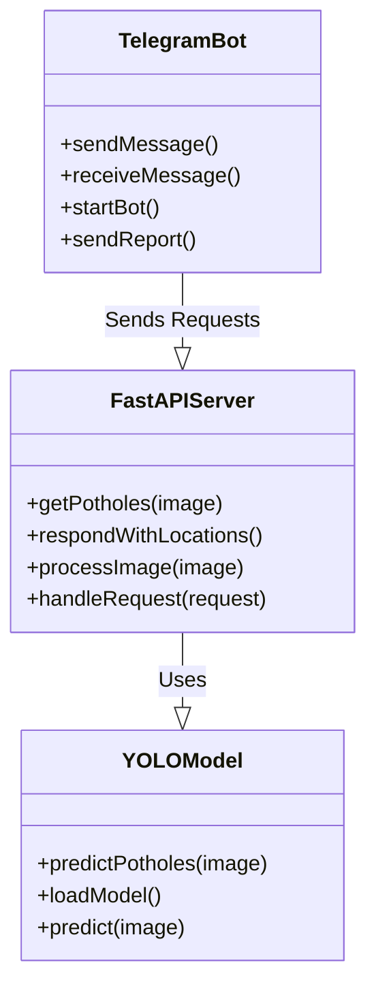
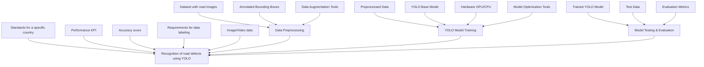
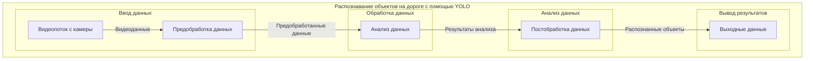

## Test 4
<code>
+----------------------------------+
|            FastAPI Server        |
+----------------------------------+
| - model: YOLO                    |
| - database: SQL                  |
+----------------------------------+
| + detect_potholes(image: Image)  |
| + store_detection(result: JSON)  |
+----------------------------------+
                  |
                  |
                  | API Calls
                  |
                  v
+----------------------------------+
|        Telegram Bot Client       |
+----------------------------------+
| - api_client: FastAPI API Client |
| - chat_id: int                   |
+----------------------------------+
| + receive_image()                |
| + send_result()                  |
+----------------------------------+
</code>

## Test 3

## Test 2

## Test 1

---

## Test0

