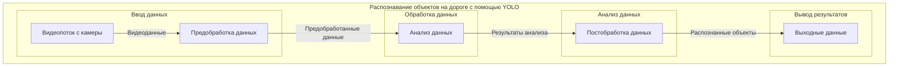

## Test 1

```mermaid
graph TD
  A0[Recognition of road defects using YOLO]
  K1[Standards for a specific country] --> A0
  K2[Performance KPI] --> A0
  K3[Accuracy score] --> A0
  K4[Requirements for data labeling] --> A0
  Image[Image/Video data] --> A0
  
  A1[Data Preprocessing] --> A0
  A2[YOLO Model Training] --> A0
  A3[Model Testing & Evaluation] --> A0
  
  R1[Dataset with road images] --> A1
  R2[Annotated Bounding Boxes] --> A1
  
  R3[Preprocessed Data] --> A2
  R4[YOLO Base Model] --> A2
  R5[Hardware (GPU/CPU)] --> A2
  
  R6[Trained YOLO Model] --> A3
  R7[Test Data] --> A3
  
  M1[Data Augmentation Tools] --> A1
  M2[Model Optimization Tools] --> A2
  M3[Evaluation Metrics] --> A3
```

---


## Test0


