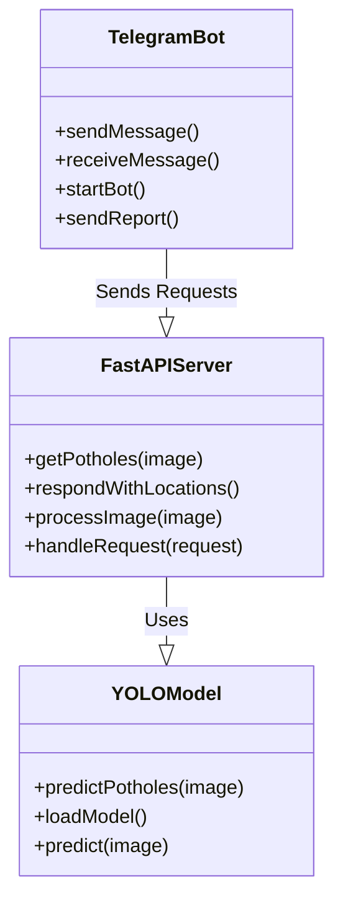

# UML-DIA

Конечно, вот пример UML-диаграммы на Mermaid, которую вы можете вставить в ваш отчет на GitHub в формате Markdown. Эта диаграмма иллюстрирует основные компоненты вашего проекта.

Объяснение компонентов:

- `YOLOModel`: Предобученная модель YOLO для распознавания выбоин.
- `FastAPIServer`: Сервер на FastAPI, который обрабатывает изображения и делает запросы к модели YOLO.
- `TelegramBot`: Телеграм-бот, который отправляет запросы на FastAPI сервер и получает результаты.

Надеюсь, это поможет вам в создании отчета по вашему проекту!