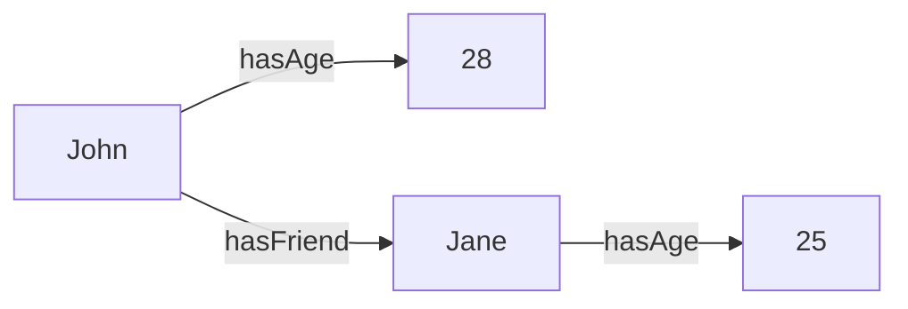

## YOLOv8 Project in the form of SPARQL-like rules:

### 1. Class-Class Rules:
```
If ind belongs to class RoadImage:
Then ind belongs to class ProcessedData

If ind belongs to class DetectedPothole:
Then ind belongs to class RoadHazard

If ind belongs to class NeuralModelParameters:
Then ind belongs to class SystemKPI
```

### 2. Class-Property Rules:
```
If ind belongs to class DetectedPothole:
Then ind has areaValue of property DetectedArea

If ind belongs to class NeuralModelParameters:
Then ind has accuracyValue of property ModelAccuracy

If ind belongs to class NeuralModelParameters:
Then ind has modelName of property YOLO

If ind belongs to class FastAPI:
Then ind has serverFunctionality of property BackendFunctionality

If ind belongs to class TelegramBot:
Then ind has userInterface of property ClientUI
```

### 3. Property-Class Rules:
```
If ind has areaValue > 0.9 of property DetectedArea:
Then ind belongs to class CriticalPothole

If ind has accuracyValue > 0.95 of property ModelAccuracy:
Then ind belongs to class HighAccuracyModel
```

### 4. Property-Property Rules:
```
If ind has areaValue > 0.9 of property DetectedArea:
Then ind has criticalAlert of property HazardAlert

If ind has accuracyValue < 0.8 of property ModelAccuracy:
Then ind has tuningRecommendation of property ModelTuningAdvice
```

### 5. Property-Property Rules (Different Subjects):
```
If RoadImage has property DetectedPothole:
Then TelegramBot sends UserAlert

If NeuralModelParameters has accuracyValue < 0.8 of property ModelAccuracy:
Then FastAPI logs PerformanceIssue

If DetectedPothole has areaValue > 0.9 of property DetectedArea:
Then TelegramBot sends CriticalHazardAlert
```

This knowledge base is tailored to the specifics of the project, where the system processes road images to detect potholes, uses a neural model (YOLO) with certain accuracy parameters, and integrates with FastAPI and a Telegram Bot for user interaction.


---

### Example


---

## SPARQL: The Query Language for the Semantic Web 🌍

Welcome to the wonderful world of SPARQL! Here, you'll get an understanding of what SPARQL is and how it's used with Knowledge Bases to unlock the potential of the Semantic Web. 

### Table of Contents 📜
- [Introduction to SPARQL 🎉](#introduction-to-sparql-)
- [Why Use SPARQL? 🤔](#why-use-sparql-)
- [Basic Syntax and Structure 📖](#basic-syntax-and-structure-)
- [Examples Using mermaid 🧜](#examples-using-mermaid-)
- [Useful Resources 📚](#useful-resources-)

### Introduction to SPARQL 🎉
SPARQL (pronounced "sparkle") is the query language for querying databases stored in the Resource Description Framework (RDF) format. It's the standard way to explore and extract data from Knowledge Bases on the Semantic Web.

### Why Use SPARQL? 🤔
1. **Standardized** 🌐: It's an official W3C standard, ensuring compatibility and widespread adoption.
2. **Flexible** 💡: You can query any part of the RDF data model, be it triples, graphs, or more.
3. **Powerful** 🔥: SPARQL supports complex queries including joins, unions, and more.

### Basic Syntax and Structure 📖
A typical SPARQL query looks like this:
```sparql
PREFIX ex: <http://example.org/>
SELECT ?subject WHERE {
  ?subject ex:property ex:object .
}
```
- `PREFIX` defines a shorthand for a full URI.
- `SELECT` specifies the variables to return.
- The WHERE clause contains the triple patterns to match.

### Examples Using mermaid 🧜
For visualization purposes, let's consider a simple RDF graph and how a SPARQL query would interact with it.

Here's a representation of RDF triples using mermaid:


Given this, a SPARQL query to find John's friends would be:
```sparql
PREFIX ex: <http://example.org/>
SELECT ?friend WHERE {
  ex:John ex:hasFriend ?friend .
}
```

The result would be "Jane".

### Useful Resources 📚
- [W3C SPARQL Specification](https://www.w3.org/TR/sparql11-query/)
- [SPARQL Tutorial](https://www.w3schools.com/xml/xml_sparql.asp)
- [DBpedia - Public SPARQL Endpoint](https://dbpedia.org/sparql)

---

